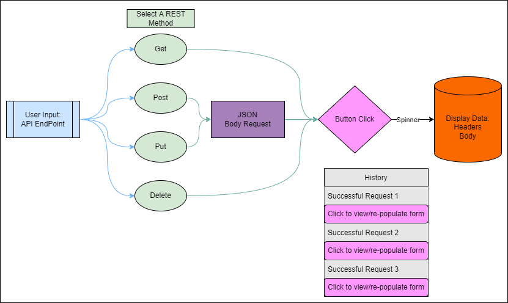

# RESTy

This application is a way for users to understand a REST api and see the documented methods, API, and results they are given.

## Usage

The user will be able to enter an API which they will hit, choose a method, and get back the results
The method of which the user has chosen will be saved in a history box so they can view their past searches and re-populate the form with past user entries.

## UML

## Testing

Run `npm test` to see our test coverage

## Contributors

- Charlie Fadness

## Resoucres

- Heather Bisgaard
- [Difference between sass and node-sass resource 1](https://www.peterbe.com/plog/quick-comparison-between-sass-and-node-sass)
- [Difference between sass and node-sass resource 2](https://stackshare.io/stackups/node-sass-vs-sass)
- [Testing Queries](https://testing-library.com/docs/queries/about)
- [Web Dev Simplified on UseEffect](https://www.youtube.com/watch?v=0ZJgIjIuY7U&ab_channel=WebDevSimplified)

